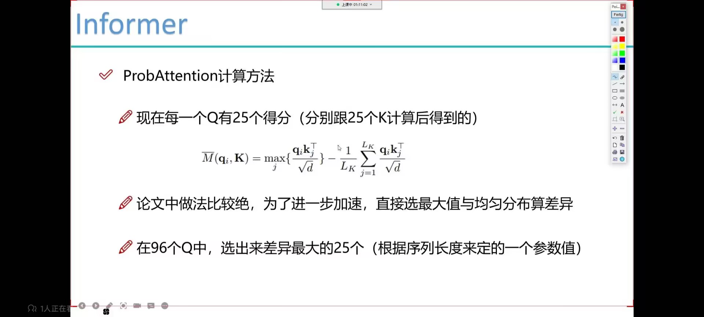
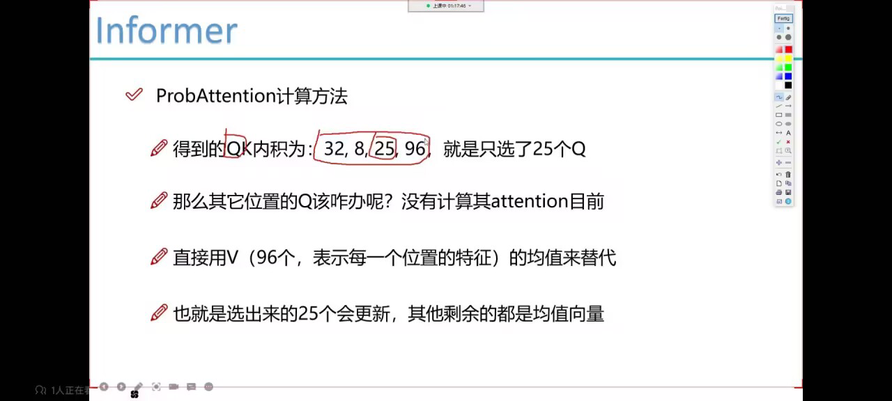
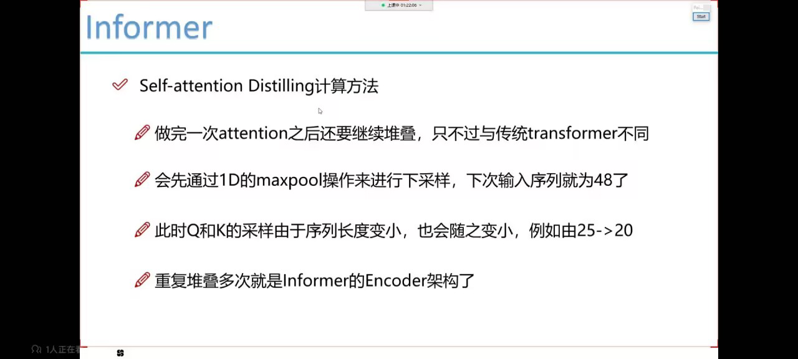
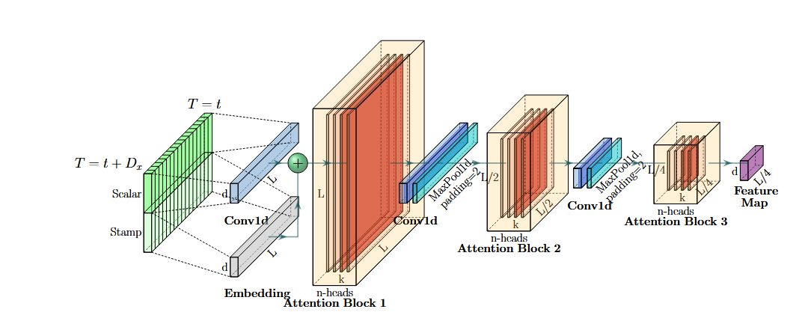
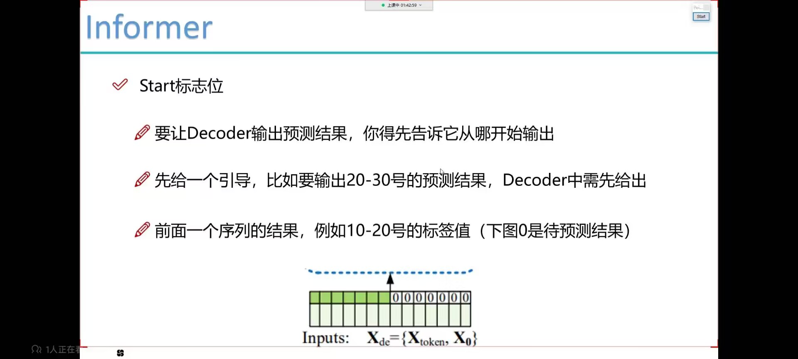
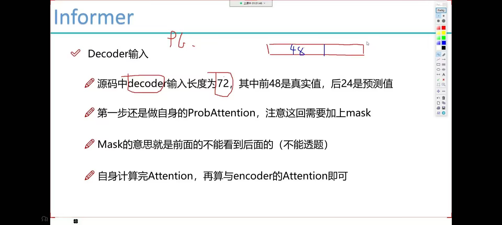
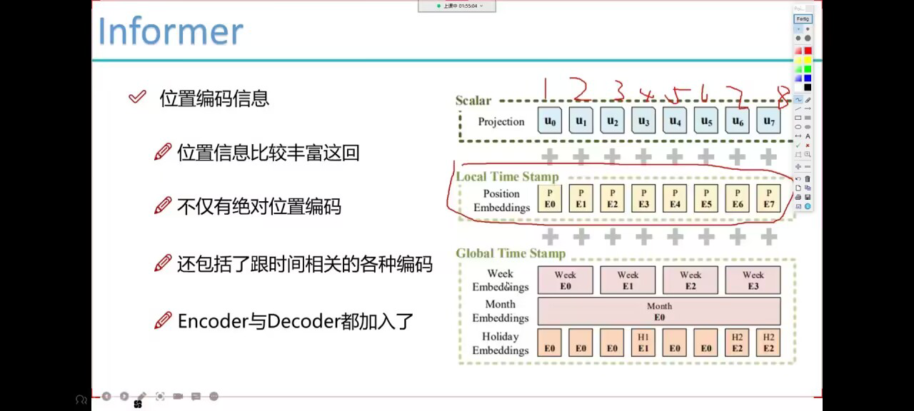
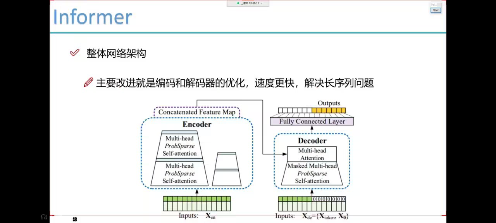

```bash
python -u main_informer.py --model informer --data ETTh1 --attn prob --freq h

# ETTh2
python -u main_informer.py --model informer --data ETTh2 --attn prob --freq h

# ETTm1
python -u main_informer.py --model informer --data ETTm1 --attn prob --freq t

python -u main_informer.py --model informer --data WTH --attn prob --freq h
```
- informer 预测长时间序列，套tansformer架构
  - 重构每一个输入
- lstm串行效率低，收敛比较难
- informer要解决的问题
  - attention要算的更快
  - decoder要一次性输出所有预测
  - 堆叠encoder也要更快
- ProbAttention计算方法
  - 输入序列长度为96,首先在K中进行采样,随机选25个K
  - 现在要选出来的是一些重要的Q, 正常情况需每一个Q跟96个K计算
  - 重要的Q不用非得计算那么多，跟部分K计算的结果也可以当作其分布
  - 例如源码输出结果: 32, 8, 96个q, 25个k表示8头，8种特征计算方式，96个Q分别跟25个K计算的内积
  - 
  - 
  - 不好的q用平均向量，与均匀差不多
  - 
  - 
  - 
  - 
  - 
  - 
# 思路
## 1.用手里的环境也可以
## 2.下载数据集
## 3.issue
## 4.数据处理与模型搭建
## 5.96+24=48+48个带有原数据的先验知识+24个预测值
## 6.自定义数据 Dataset_Custom
### 'Solar':{'data':'solar_AL.csv','T':'POWER_136',
### 'M':[137,137,137],'S':[1,1,1],'MS':[137,137,1]},T为标签
### cols = list(df_raw.columns); cols.remove(self.target); cols.remove('date')  #去掉标签和日期，只保留特征
###   border1 = border1s[self.set_type]  border2 = border2s[self.set_type]边界起始值与终止值
###             if self.scale:  # 标准化
###             train_data = df_data[border1s[0]:border2s[0]]
###             self.scaler.fit(train_data.values)
###             data = self.scaler.transform(df_data.values)
## 7.优化器选adam不用改,损失函数选MSE可改
# 核心 8.# 遍历loader就是遍历 __getitem__函数
## 8. torch.cat([batch_y[:,:self.args.label_len,:], dec_inp], dim=1).float().to(self.device)
## 9. 24个0与之前的48个先验值在第一个维度拼接，
## 10.outputs = self.model(batch_x, batch_x_mark, dec_inp, batch_y_mark)，经模型传出的outputs是48+24个预测值
## encoder做embedding操作，decoder也做embedding操作，所有的transformer都做embedding操作
   queries = self.query_projection(queries).view(B, L, H, -1)
        keys = self.key_projection(keys).view(B, S, H, -1)
        values = self.value_projection(values).view(B, S, H, -1)